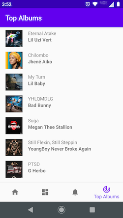

## TunesFeed: iTunes RSS Feed Example Android App

TunesFeed is an example project that demonstrates use of the latest Android Development best-practices
for UI (JetPack/Lifecycle), Navigation, MVVM (ViewBinding and DataBinding), Kotlin Coroutines, etc.

----

### Features & Architectural Considerations

 - Leverages approaches from Google's latest **Android Architecture Blueprints** per [https://github.com/android/architecture-samples](https://github.com/android/architecture-samples)
 - A single-activity UI architecture, with Bottom Navigation Bar using the **[Navigation Component](https://developer.android.com/guide/navigation/navigation-getting-started)** to manage fragment operations.
 - A **Presentation Layer** that re-uses a single, parameterized fragment and a **ViewModel** per screen or feature; e.g. **FeedListFragment** is parameterized by **FeedType** for UI component re-use.
 - Reactive UIs using **LiveData** observables and **Data Binding**; changes to underlying data propagate via observation, so are updated only when necessary.
 - An abstracted **data layer** using the **Service Locator** pattern to provide either a **mocked** or real implementation for an abstract **repository interface**, describing the web-service / data-source layer.
 - Service layer leverages **Kotlin Coroutines** (suspend functions; launched in viewModelScope) per [https://developer.android.com/topic/libraries/architecture/coroutines](https://developer.android.com/topic/libraries/architecture/coroutines)
 - Entity objects and DTOs are correctly distinct per proper **Separation of Concerns** and **SOLID** architecture principles.
